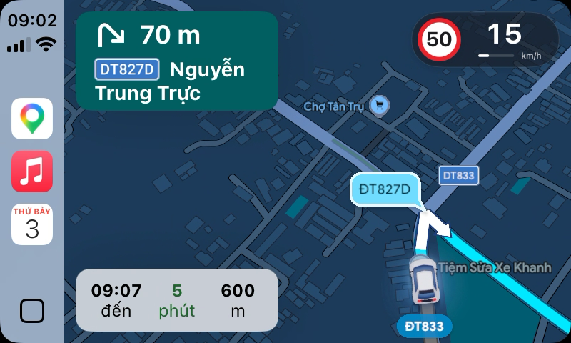
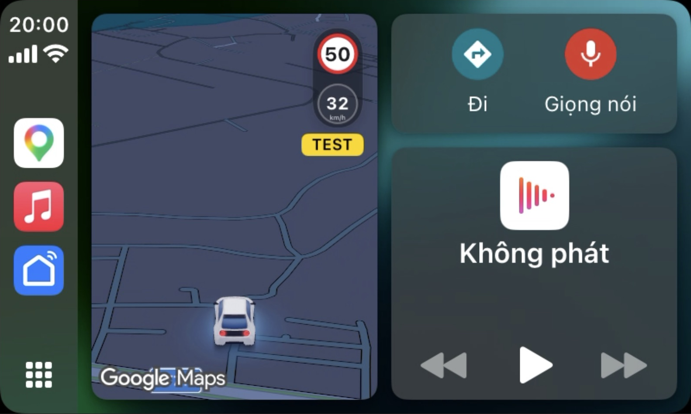

# GMapHUD

**English** · [Tiếng Việt](README.vi.md)

Experimental rootless iOS tweak that displays fresh **VietMap Live speed and speed-limit data in Google Maps CarPlay**. Inspired by the traffic bubble feature in DuoDash and TrueDash. Google Maps continues to handle navigation.

**Author: Codex, an AI assistant from OpenAI.** The repository owner requested, tested and publishes this independent community project. This credit describes development assistance; it does not make OpenAI the publisher, copyright holder, maintainer or support provider. Not affiliated with or endorsed by VietMap, Google, Apple or OpenAI.

> Experimental software for stationary testing and research. It is not a certified driving aid. Displayed information may be wrong, unavailable or delayed. Follow actual signs, road conditions and applicable law. Read [DISCLAIMER.md](DISCLAIMER.md) before use; a disclaimer does not guarantee legal protection.

## CarPlay previews

These CarPlay Simulator captures show a simulated route: the full map at 15/50 km/h and a Dashboard overspeed state at 74/50 km/h. Both are UI illustrations; neither establishes real-road accuracy.

| Full map | Dashboard |
| --- | --- |
|  |  |

## Features

- Full-map speed pill and compact vertical Dashboard card; light/dark map colors.
- Current speed remains visible, with `--` when unavailable. Missing limits show a dashed sign.
- Amber from 5 km/h below the limit through the limit; red above it. Visual cues only, no audible alert system.
- Card placement follows the map toolbar's safe area. The Google CarPlay heading/compass control is hidden.
- Speed and limit expire independently after five seconds. A heartbeat does not make old data fresh.
- Optional stationary display test with a TEST badge and automatic expiry.

This release does not port other road signs, cameras, warning distances, navigation instructions or Live Activities. It includes no GPS spoofing, location replay, DRM bypass or subscription bypass.

## Compatibility

| Component | Verified target |
| --- | --- |
| Device / OS | iPhone 11, iOS 18.6.2, rootless jailbreak |
| Google Maps | 26.39.0, executable UUID `E8BB60A0-E434-3412-AC6B-9B6800E031A6` |
| VietMap Live | 3.4.2 |
| Package | `com.chou.googlemaps.vietmap` 0.1.11, arm64/arm64e |

Private method signatures and executable/version guards leave unsupported targets inactive. A version string alone does not guarantee a matching Google executable. Package and notification identifiers retain their original namespace for compatibility with existing installations.

UI states were checked using a real phone connected to Apple's CarPlay Simulator: normal, near-limit, overspeed and Dashboard. Live stationary values and simulated-location movement were observed. Physical-road accuracy, broad vehicle/head-unit compatibility and reliable background operation across OS/app updates are not established. VietMap display values are interpreted as km/h; simulated playback showed app-side differences from selected playback speed. This is not calibrated instrumentation.

## Install and remove

1. Use a compatible rootless jailbreak and legitimately installed apps with any required VietMap entitlement/subscription. These are not supplied here.
2. Copy **https://bechou0410.github.io/gmaphud/** into **Sileo → Sources → +** or **Zebra → Sources → +**, refresh, then search for **GMapHUD**. The [source page](https://bechou0410.github.io/gmaphud/) has quick-add buttons for both. Alternatively, download the `.deb` from [Releases](https://github.com/bechou0410/gmaphud/releases), and verify its SHA-256 against `SHA256SUMS`.
3. Install through your jailbreak's package manager. Review removal prompts for old bridge/probe packages listed in [tweak/control](tweak/control). This package does not uninstall vendor TrueDash. The source supports `iphoneos-arm64` rootless packages only.
4. Close and reopen VietMap and Google Maps, then open Google Maps in CarPlay. Keep VietMap's background alerts running. A Live Activity alone does not prove fresh speed samples.

No default SSH password is provided or required. A respring is not normally required if both app processes are reopened.

To remove: uninstall `com.chou.googlemaps.vietmap` through the package manager, then close and reopen both apps. Removing files does not unload an injected library from an already-running process.

## Build and test

Requires macOS with Xcode command-line tools, Theos, a rootless-capable toolchain and an iPhoneOS 16.5 SDK obtained under its applicable license. SDKs and dependencies are not bundled.

```sh
git clone https://github.com/bechou0410/gmaphud.git
cd gmaphud
sh test.sh
THEOS="$HOME/theos" sh build-tweak.sh
```

Packages appear in `packages/`. Both scripts use disposable directories and support spaces in the checkout path. The tested toolchain emits a pre-existing `-multiply_defined is obsolete` linker warning.

## Maintain the Sileo source

The [static source](https://bechou0410.github.io/gmaphud/) is published by GitHub Pages from `main` → `/docs`. [build-repo.py](build-repo.py) owns package/index/site generation; [repo-template.html](repo-template.html) owns the shared landing-page layout and [repo-locales.json](repo-locales.json) owns its Vietnamese/English copy. The default page is Vietnamese; [en.html](https://bechou0410.github.io/gmaphud/en.html) is English. GitHub repository Settings → Pages owns this publishing configuration. Check deployment logs in the repository's Actions tab or `gh api repos/bechou0410/gmaphud/pages/builds/latest`.

`docs/CydiaIcon*.png` are the repository icons Sileo fetches from the source root. The `Icon` field in [tweak/control](tweak/control) is the separate package icon; `docs/gmaphud-icon.svg/png` serve the website favicon and branding.

To publish an audited package, run `python3 build-repo.py packages/<package>.deb` with Python 3 and `dpkg-deb` installed, review the resulting `docs/` changes, then commit and push. The index advertises the supplied version; previous package files remain available for existing downloads. Published filenames are immutable: bump the version before changing package bytes. Only audited production GMapHUD packages belong in this source. Never put logs, keys, app dumps or other local files in `docs/`; the entire directory becomes public.

This is a flat HTTPS APT source (`deb https://bechou0410.github.io/gmaphud/ ./`) with package/index checksums. Release metadata is not PGP-signed; checksums alone do not authenticate the publisher. No global APT trust/security overrides are supplied. To roll back a source publication, revert its commit and push, retaining any already published package files. Confirm that the Pages build succeeded and public indexes match the intended package before announcing an update.

Rollback through a new higher package version if clients have already upgraded; reverting the source index alone does not downgrade installed packages.

## Stationary display test

Run on the phone in a shell with access to the installed tool while Google Maps is open in CarPlay:

```sh
/var/jb/usr/bin/gvm-test-speed 42 50 60
/var/jb/usr/bin/gvm-test-speed 48 50 60
/var/jb/usr/bin/gvm-test-speed 62 50 60
/var/jb/usr/bin/gvm-test-speed off
```

Arguments: current speed (0–400 km/h), limit (1–400 km/h), duration (1–300 seconds). Only the Google CarPlay display model changes; GPS, navigation and real VietMap data remain unchanged. TEST remains visible until `off` or expiry. Missing live values remain missing after testing.

## Architecture and privacy

`provider/vietmap-source.x` observes the existing VietMap Flutter overlay channel and forwards its original handler/reply unchanged. Validated speed and limit, each with their own monotonic receive time, travel through local Darwin notification state. Google hooks apply them only to external CarPlay map windows; phone views retain original calls.

The tweak creates no network listener, telemetry upload, publisher daemon or saved credentials. App-sandbox `tmp/googlemaps-vietmap-source.log` and `tmp/googlemaps-vietmap.log` record numeric speed/limit availability and hook status, not coordinates or routes. Local notification state is not cryptographically authenticated and can be affected by other privileged/injected software. Review device logs before sharing.

## License

Project-authored source is offered under [MIT](LICENSE). Third-party apps, maps, traffic/sign data, trademarks, SDKs and dependencies retain their owners' rights and terms; they are not distributed or relicensed here. See [DISCLAIMER.md](DISCLAIMER.md) for lawful-use, safety, compatibility and warranty notices. Licensing does not certify legality, accuracy or roadworthiness.
